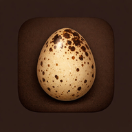

# Quail Tracker

A mobile-friendly, self-hosted web app for managing coturnix quail incubation batches, tracking lifecycle milestones, and logging production data. Runs as a Docker container on a home server.



---

## Features

- **Multi-batch calendar** — Track multiple incubation batches simultaneously. Each batch auto-generates its full incubation and brooder milestone timeline on a shared calendar view.
- **Milestone guidance** — Every key event (candling, lockdown, hatch, sexing, harvest window) includes temperature targets, humidity targets, and practical tips.
- **Custom events** — Add your own notes to any calendar date alongside the auto-generated milestones.
- **Production logs** — Four dedicated log tabs with charts, stats, and full edit/delete support:
  - **Egg Production** — Daily egg counts with optional hen count and notes
  - **Incubation** — Eggs set, candled out, and hatched per batch with hatch rate %
  - **Hatch** — Rooster vs. hen breakdown per batch with R:H ratio tracking
  - **Harvest** — Birds harvested and total weight (oz) per session
- **Charts with range toggles** — All four logs include a line chart with 7D / 30D / 3M / 1Y range filter and summary stats.
- **Export** — Individual CSV export per log tab, plus a single-click **Export All** that produces a multi-sheet `.xlsx` file.
- **Calendar export** — Download a `.ics` file or subscribe via URL to sync milestones into Google Calendar, Apple Calendar, or Outlook.
- **Print view** — Print-optimized layout expands the calendar to show full event labels in each day cell.
- **Home screen installable** — Web app manifest included for adding to Android or iOS as a standalone PWA.
- **Craftsman aesthetic** — Warm earth tones and serif headings designed to feel at home on a homestead.

---

## Stack

| Layer | Technology |
|---|---|
| Backend | Python 3.12 / Flask / Gunicorn |
| Frontend | Single-file HTML + CSS + JS (no framework) |
| Charts | Chart.js 4.4.1 (CDN) |
| Excel export | SheetJS 0.20.3 (bundled locally) |
| Storage | JSON file on host, mounted as Docker volume |
| Deployment | Docker + Docker Compose |
| Reverse proxy | Caddy (optional, see `Caddyfile-snippet.txt`) |

---

## Setup

### Prerequisites

- Docker and Docker Compose installed on your server
- A directory structure like `/opt/docker-compose/` and `/opt/containers/` (or adjust paths to suit your setup)

### 1. Clone the repo

```bash
git clone https://github.com/leeroy4000/quail-tracker.git /opt/docker-compose/quail-tracker
```

### 2. Create the data directory

```bash
mkdir -p /opt/containers/quail-tracker/data
```

### 3. Create your `.env` file

```bash
cat > /opt/docker-compose/quail-tracker/.env << 'EOF'
TZ=America/Chicago
EOF
```

Adjust the timezone to your local zone.

### 4. Build and start

```bash
cd /opt/docker-compose/quail-tracker
docker compose up -d --build
```

### 5. Open the app

```
http://<your-server-ip>:5000
```

---

## Updating

```bash
cd /opt/docker-compose/quail-tracker
git pull
docker compose up -d --build
```

---

## Reverse Proxy (Optional)

To serve the app via a hostname instead of IP:port, see `Caddyfile-snippet.txt` for an example Caddy configuration.

---

## Project Structure

```
quail-tracker/
├── app/
│   ├── app.py                  # Flask backend + API endpoints
│   ├── requirements.txt        # Python dependencies (flask, gunicorn)
│   ├── Dockerfile
│   ├── static/
│   │   ├── icon-180.png        # Apple touch icon
│   │   ├── icon-192.png        # Android home screen icon
│   │   ├── icon-512.png        # High-res icon
│   │   ├── manifest.json       # PWA web app manifest
│   │   └── xlsx.full.min.js    # SheetJS bundled locally
│   └── templates/
│       └── index.html          # Entire frontend (HTML + CSS + JS)
├── docker-compose.yml
├── Caddyfile-snippet.txt
├── .gitignore
└── README.md
```

---

## Data

App data is stored at `/opt/containers/quail-tracker/data/quail_data.json` on the host, mounted into the container as a volume. This file is excluded from git and persists across container rebuilds.

---

## Calendar Subscription

Once running, your milestones are available as a live iCalendar feed at:

```
http://<your-server-ip>:5000/calendar.ics
```

Paste this URL into any calendar app's "subscribe to calendar" feature. New batches you add will automatically appear on the next sync.

---

## Coturnix Quick Reference

| Event | Timeline |
|---|---|
| Incubation | 17–18 days |
| Lockdown | Day 15 |
| Hatch | Days 17–18 |
| Move to brooder | Day 0 post-hatch |
| Sexing window | Week 3 |
| Harvest window | Weeks 6–8 |
| Egg production begins | Weeks 6–8 |
| Colony ratio | 1 rooster : 4–5 hens |

---

## License

MIT
